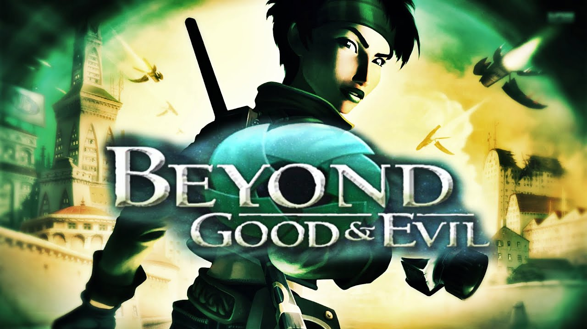

The planet Hillia is a telegram bot. In it you will be able to 56 species of animals, read the charter of "Carlson and Peters", read about the planet itself and even learn about the rebels from the IRIS network

This bot was made for fans and from fans. Use it wisely. Deploy where you want and how you want.

